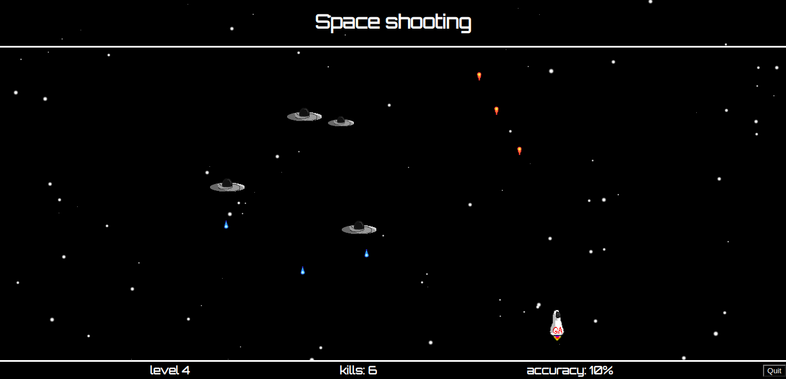
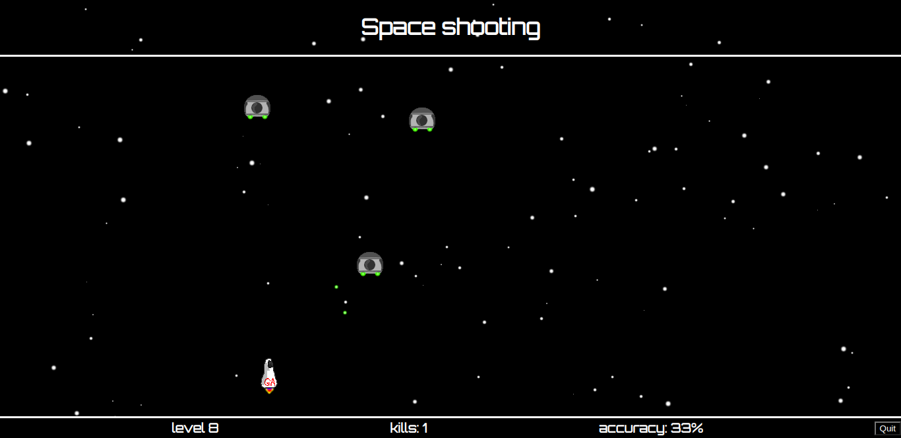
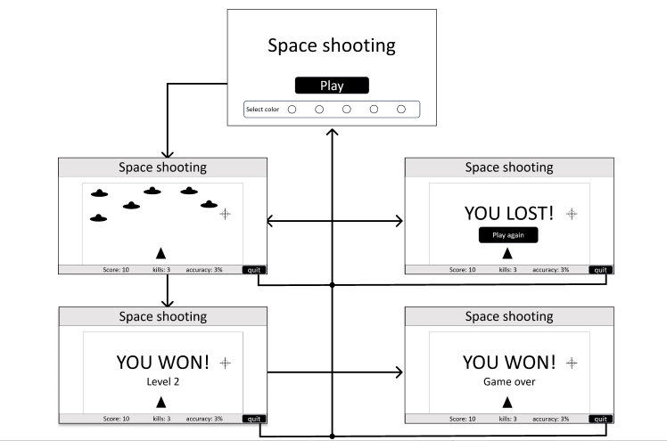

# Browser game project

## Describtion

The objective of this project is to create a browser game. The game is similer to old space fighting alien shooting games.

The game is hosted [here.](https://spaceshooting.surge.sh/)

### Screenshots




### Features

* Space shooting game features a multiple levels of fighting ships.

* Multiple control keys for compability.

* Game statistics for competition.

* stable 40 frames per second.

### How to Get Started

Read [project requirements](https://git.generalassemb.ly/SEI-06-Bahrain/SEI-Info/tree/main/Lessons/Week02/Day04/u1_project_prompt) for the game and plan what features are in the game and lay them down in Trello.


#### The game into these sections:

* render

* game logic

* user input


all these sections in the code are excuted every frame using [setInterval](https://www.w3schools.com/jsref/met_win_setinterval.asp) methode.
```
myInterval = setInterval(function, milliseconds);
```


### render

To render the game a png or gif images is used.


Every frame the game logic decide what position the image is going to be based on game logic and user input.

#### moving stuff around

Moving the ship is just relocating or render the same image few pixels away every frame.


get the current position

```this.render.getBoundingClientRect('position').left```

next position is **entity.speed** pixels away from current position


### game logic

Since the same positioning and moving functions are needed for all the moving stuff in the game a class named **Entity** is created with these functionalities.


```
entity.xposition()  //get position in horizontal axis

entity.yposition()  //get position in vertical axis

entity.move(x, y, bordered = true)  //move object to (x,y)
```

The **Entity** class is extended to other classes to create objects with diffrent properties such as shooting and death animation.

* player

* enemy

* projectile


#### Timimg

Some funcions are not supposed to invoked every every frame. A cout down timer is made to activate the function when it reachs 0.

```
  //cooldown counter
  player.coolDownCounter =
    player.coolDownCounter > 0 ? (player.coolDownCounter -= 1) : 0
```

#### Collision

For detecting collisions the distance between the ship and all the projectiles in the game is calculated every frame.


### user input

Every frame the state of the input is checked then the corresponds action is excuted.

The state of the input is changed only when the event is occured.

## wireframe

This is simple wireframe of the desired website.



The website has two html pages. The main page showing the title and color select option. The other is to run the game logic and render.


## progress

view progress in Trello through this 
[link](https://trello.com/invite/b/vWWqVCgA/ATTIcddb1bba33c5ed8bf5f7523be2d4aa844875E7C2/game)

## credits

[mdn web docs](https://developer.mozilla.org/en-US/docs/Web/API/Element/getBoundingClientRect)